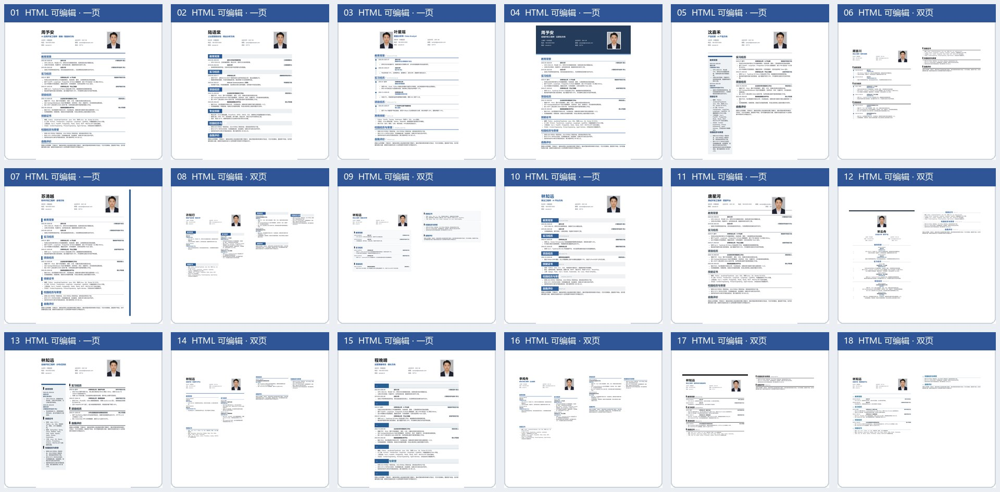

# Offer-skills

`Offer-skills` 是一个面向中文求职简历的可复用技能包。它可以根据你的简历信息生成真正可编辑的 HTML 简历，也可以根据你上传的参考简历图片复刻版式，最后在浏览器中继续编辑并导出 PDF。

## 核心能力

- 根据姓名、求职方向、教育经历、实习/工作经历、项目、技能和照片生成 HTML 简历。
- 从 18 个编号模板中选择版式；模板包含单栏、双栏、侧栏、时间轴、卡片、顶部横幅、居中作品集、黑白学术和双页布局。
- 接收用户上传的简历截图或设计参考图，分析栏位、间距、字体层级、颜色和单双页结构，再生成可编辑 HTML。
- HTML 正文使用真实文本，不使用截图代替文字，不需要 Word，也不依赖服务器。
- 浏览器内支持文字编辑、照片替换、字体、文字颜色、加粗和导出 PDF。
- 模板和示例信息均使用虚构内容，不包含用户隐私。

## 使用方式

### 方式一：选择技能包自带模板

把简历信息告诉 AI，并指定使用 `$Offer-skills`。AI 会根据内容密度和目标岗位选择合适的编号模板，填充后生成新的 HTML 文件。

示例：

> 请使用 `$Offer-skills`，根据我提供的教育经历、实习经历、项目经历和技能，制作一份后端开发岗位简历。优先选择 14 号双栏模板，输出 HTML，不要输出 Word。生成后我要在浏览器中编辑并导出 PDF。

### 方式二：上传图片复刻模板

上传一张简历截图或模板图片，并告诉 AI：

> 请复刻这张图片的简历版式，保留它的栏位、间距、字体层级、颜色和单双页结构，但最终输出必须是可编辑的 HTML 文本。

AI 会把图片作为视觉参考，而不是把图片直接放进简历正文。复刻后的文字、标题、时间、项目和技能仍然可以在浏览器中编辑。

## 浏览器编辑与导出

打开生成的 `.html` 文件后：

1. 点击“编辑”，直接修改简历文字。
2. 选中文字后，可在工具栏中选择“字体”、设置“文字颜色”或点击“加粗”。
3. 点击“替换照片”，选择本地证件照。
4. 点击“导出 PDF”，在浏览器打印窗口中选择“另存为 PDF”。

工具栏位于简历上方，不会遮挡简历内容；打印或导出 PDF 时会自动隐藏。

## 18 个 HTML 模板缩略图



缩略图展示的是模板的实际 HTML/PDF 版式。标记为“双页”的模板会在 PDF 中产生明确的第一页和第二页。

| 编号 | 主要结构 | 页数 | 文件 |
|---:|---|---:|---|
| 01 | 经典蓝线单栏 | 一页 | `assets/templates-html/01-大厂极简简历模板.html` |
| 02 | 灰蓝标题带 | 一页 | `assets/templates-html/02-大厂极简简历模板.html` |
| 03 | 中英双语时间轴 | 一页 | `assets/templates-html/03-大厂极简简历模板.html` |
| 04 | 深色顶部横幅 | 一页 | `assets/templates-html/04-大厂极简简历模板.html` |
| 05 | 左侧信息栏 | 一页 | `assets/templates-html/05-大厂极简简历模板.html` |
| 06 | 黑白时间轴 | 双页 | `assets/templates-html/06-大厂极简简历模板.html` |
| 07 | 右侧蓝色边栏 | 一页 | `assets/templates-html/07-大厂极简简历模板.html` |
| 08 | 蓝色双栏 | 双页 | `assets/templates-html/08-大厂极简简历模板.html` |
| 09 | 黑白卡片 | 双页 | `assets/templates-html/09-大厂极简简历模板.html` |
| 10 | 蓝灰色标题条 | 一页 | `assets/templates-html/10-大厂极简简历模板.html` |
| 11 | 衬线字体分隔 | 一页 | `assets/templates-html/11-大厂极简简历模板.html` |
| 12 | 居中作品集 | 双页 | `assets/templates-html/12-大厂极简简历模板.html` |
| 13 | 黑白侧栏 | 一页 | `assets/templates-html/13-大厂极简简历模板.html` |
| 14 | 蓝线双栏 | 双页 | `assets/templates-html/14-大厂极简简历模板.html` |
| 15 | 现代蓝色标题带 | 一页 | `assets/templates-html/15-大厂极简简历模板.html` |
| 16 | 紧凑双栏 | 双页 | `assets/templates-html/16-大厂极简简历模板.html` |
| 17 | 学术黑白双页 | 双页 | `assets/templates-html/17-大厂极简简历模板.html` |
| 18 | 现代蓝色双页 | 双页 | `assets/templates-html/18-大厂极简简历模板.html` |

## 文件结构

```text
Offer-skills/
├── README.md
├── SKILL.md
├── agents/openai.yaml
└── assets/
    ├── fictional-resume-photo.png
    ├── resume-data-template.json
    ├── resume-template-editable.html
    ├── resume-template-two-page.html
    ├── template-overview.jpg
    └── templates-html/
        ├── 01-大厂极简简历模板.html
        ├── ...
        └── 18-大厂极简简历模板.html
```

所有编号模板都是 HTML 文件；正文、标题、时间、项目和技能为可编辑文本。模板只引用 `assets/fictional-resume-photo.png` 这一张虚构示例照片。

## 隐私边界

- 不要把真实姓名、电话、邮箱、雇主、项目链接或真实照片写入技能说明、README、示例数据或缩略图。
- 技能包中的学校、公司、姓名、联系方式、项目和照片均为虚构示例。
- 用户真实信息只应出现在用户明确要求生成的最终简历中，不应回写到技能包本身。

## 其他资源

- `assets/resume-data-template.json`：匿名简历信息数据结构。
- `assets/resume-template-editable.html`：紧凑的一页 HTML 示例。
- `assets/resume-template-two-page.html`：双页 HTML 示例。
- `assets/fictional-resume-photo.png`：虚构示例证件照。
- `assets/template-overview.jpg`：18 个模板的缩略图总览。
